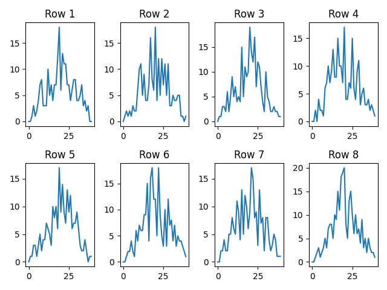
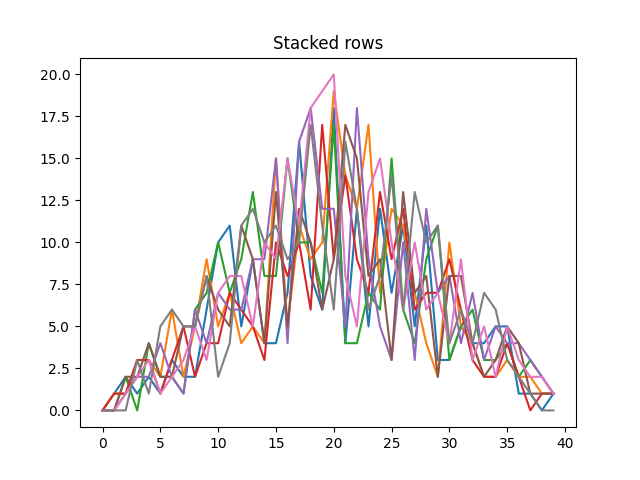

# Assignment 4: Data Visualization

**Imports**

For all four tasks, some libraries will be needed to solve the problems. These are imported:

```python
import numpy as np
import matplotlib.pyplot as plt
```


## Task 1: Custom Plotting Function
Firstly, 4 series are loaded using numpy's load-function:
```python
series_01 = np.loadtxt(fname='dat/series-01.csv', delimiter=',')
series_02 = np.loadtxt(fname='dat/series-02.csv', delimiter=',')
series_03 = np.loadtxt(fname='dat/series-03.csv', delimiter=',')
series_04 = np.loadtxt(fname='dat/series-04.csv', delimiter=',')
```
### visualizer()
The primary function for solving this task is 'visualizer'. Firstly, a variable is created containing the average of the series taken as the 'series'-argument of the function. Then, the plot is created an saved as a file in the 'figs' folder as the 'filename'-argument of the function. Then, the figure is closed.
```python
def visualizer(series, filename):
    ave_value = np.mean(series, axis=0)
    plt.plot(ave_value)
    plt.savefig(f'figs/{filename}.png')
    plt.close()
```
### main()
The 'main'-function is used to call the 'visualizer'-function four times for a different series and with a different 'filename' each time.
```python
def main():
    visualizer(series_01, 'Series 01 visualization')
    visualizer(series_02, 'Series 02 visualization')
    visualizer(series_03, 'Series 03 visualization')
    visualizer(series_04, 'Series 04 visualization')

if __name__ == "__main__":
    main()
```
### Output
The 4 files saved in the 'figs' folder all look like this, just with a slightly different line due to differing data.


## Task 2: Modify Figure Properties
For the second task, the series are loaded just as in task 1:
```python
series_01 = np.loadtxt(fname='dat/series-01.csv', delimiter=',')
series_02 = np.loadtxt(fname='dat/series-02.csv', delimiter=',')
series_03 = np.loadtxt(fname='dat/series-03.csv', delimiter=',')
series_04 = np.loadtxt(fname='dat/series-04.csv', delimiter=',')
```
### visualizer()
The 'visualizer'-function is largely the same as in the first task. However, in this one, additional arguments are added to the function:
- plotcolor
- plotlinewidth
- ylabel
- xlabel
- title

'ylabel', 'xlabel', and 'title' are set using matplotlib's built-in functions for setting said parameters. 'plotcolor' and 'plotlinewidth' are added as parameters within the 'plot'-function.
```python
def visualizer(series, filename, plotcolor, plotlinewidth, ylabel, xlabel, title):
    ave_value = np.mean(series, axis=0)
    plt.ylabel(ylabel)
    plt.xlabel(xlabel)
    plt.title(title)
    plt.plot(ave_value, color=plotcolor, linewidth=plotlinewidth)
    plt.savefig(f'figs/{filename}.png')
    plt.close()
```
### main()
The 'main'-function is also largely the same. However, the additional parameters are passed to the 'visualizer'-function each time it is called
```python
def main():
    visualizer(series_01, 'Series 01 visualization', 'red', 3, 'Y-axis', 'X-axis', 'Series 01')
    visualizer(series_02, 'Series 02 visualization', 'blue', 4, 'Y-axis', 'X-axis', 'Series 02')
    visualizer(series_03, 'Series 03 visualization', 'green', 5, 'Y-axis', 'X-axis', 'Series 03')
    visualizer(series_04, 'Series 04 visualization', 'yellow', 5, 'Y-axis', 'X-axis', 'Series 04')

if __name__ == "__main__":
    main()
```
### Output
The files saved in the 'figs' folder in this task look almost the same as the ones from the previous task, only with different line color and thickness and additional axis-titles.


## Task 3: To Stack or Not To Stack
For this task, only a single file is loaded:
```python
data = np.loadtxt(fname='dat/series-01.csv', delimiter=',')
```
### groupedPlots()
This function initially creates an empty figure. Then, using a for loop set to the specified range of 8, it adds a subplot with a title corresponding to the row in the csv file. 1 is added to account for 0-indexing, so that the first row is listed as 'row 1' rather than 'row 0'. Lastly, the data in said row is plotted in the subplot.

After the 8 subplots have been added, the 'tight_layout'-function is used to ensure that the subplots are readable. Then, the file is saved in the 'figs' folder.
```python
def groupedPlots(data):
    fig = plt.figure()
    for i in range(8):
        axes = fig.add_subplot(2, 4, i+1)
        plt.title(f"Row {i + 1}")
        axes.plot(data[i])

    plt.tight_layout()
    plt.savefig('figs/groupedplots.png')
```
### stackedPlots()
This function, like the last one, creates an empty figure. Then, using a for loop in the range of 8, it plots the data of 8 lines in the csv-file. Afterwards, a title is added to the figure. Then, it is saved in the 'figs' folder.
```python
def stackedPlots(data):
    plt.figure()
    for i in range(8):
        plt.plot(data[i])
    plt.title("Stacked rows")
    plt.savefig('figs/stackedplots.png')

```
### main()
For the 'main'-function, each function is called once with the 'data'-variable from the start passed as the argument.
```python
def main():
    groupedPlots(data)
    stackedPlots(data)

if __name__ == "__main__":
    main()
```
### Output
The files saved in the 'figs' folder in this task look like this, with one of them containing 8 individual subplots and the other containing all of the plots stacked together:



### Discussion
There are advantages and disadvantages for both mehotds. With the stacked plots, it is very difficult to tell the lines apart, as it is one big cluster of lines and colors. However, it might be easier to conclude a general trend from the stacked rows, although it is not as big of a problem in this case, since all the series object are similar enough to where you can easily see it from the grouped plots. With the grouped plots, the main advantage is that you can easily read each plot.
